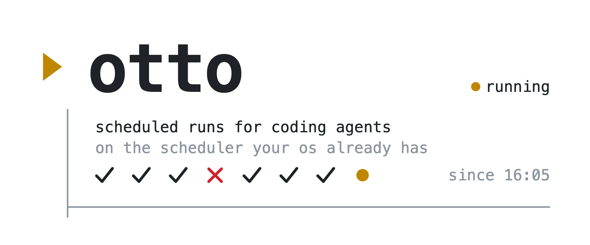

# otto

<picture>
  <source media="(prefers-color-scheme: dark)" srcset="assets/otto-banner-dark.webp">
  
</picture>

**Scheduled runs for coding agents, on the scheduler your OS already has.**

otto runs Claude Code or Codex on a schedule, without a session, a desktop app or a daemon of its own left open. You describe a job (which agent, which prompt, where and when) and otto hands it to the native scheduler: launchd on macOS, systemd timers on Linux. The agent runs on your machine, with your local tools, credentials and memory.

You manage it from one screen in the terminal. Create a job, write its prompt, see when it runs next and how its last runs went, read what the agent wrote, skip a day. A run that fails shows a notification.

- **No daemon and no desktop app.** The operating system does the waking. otto writes the unit the scheduler understands and gets out of the way: between two runs, nothing of otto is running.
- **It knows what an agent routine is.** A job is an agent, a prompt and a time. Every run leaves a record: when it started, how it ended, how long it took and what the agent wrote.
- **Claude Code and Codex**, side by side in the same list.
- **Permissions are yours.** What an agent may do is what you write in the job. otto passes it on and never adds to it.

The name comes from Otto, the school bus driver: he shows up on schedule. It also sounds like "auto".

> **Status: early.** Scheduling, the history of runs, the terminal UI and notifications are built, on macOS and Linux. Windows is [experimental](#windows-experimental). See the [Roadmap](#roadmap) for what is not.

## Quick start

```sh
brew install tarcisiopgs/tap/otto    # or: npm install -g @tarcisiopgs/otto
otto
```

1. **`n` creates a job.** The form asks for its name, the agent, the time and the days, the directory the agent runs in and the prompt file. `ctrl-s` saves, and a prompt file that is not there yet is created and opened in your editor.
2. **`S` schedules it.** The new job reads `not applied`: it is in your jobs file and the scheduler does not know it yet. `S` shows what the scheduler would be told, and `a` then `y` tells it.
3. **The OS runs it.** At its time, whether or not otto or any terminal is open. Open `otto` again to see how it went and read the output, or wait for the notification if it failed.

A scheduled run has nobody to answer a permission prompt, so the agent needs what it may do granted up front, in the job's arguments: `--permission-mode auto` for Claude Code, for one. The form starts them empty and otto suggests none.

The screen is not the only way in. There is [a command](#commands) for running, pausing, skipping, syncing and reading the output of a job, and every job is a few lines of [a file you can edit by hand](#the-jobs-file).

## Install

otto runs on macOS and Linux, on arm64 and x64, and [experimentally on Windows](#windows-experimental). Every way below installs the same native binary; the command is `otto`.

**Homebrew**, on macOS and Linux:

```sh
brew install tarcisiopgs/tap/otto
```

**npm:**

```sh
npm install -g @tarcisiopgs/otto
```

Node is only used to start the binary. A scheduled job calls it by its full path, inside the folder npm installed the package in. That path changes when you upgrade otto through a Node version manager or switch Node versions, so run `otto sync` after either.

**Debian and Ubuntu:** releases after 0.1.0 attach a `.deb` for amd64 and arm64. Download the one for your machine from the [latest release](https://github.com/tarcisiopgs/otto/releases/latest) and install it:

```sh
sudo apt install ./otto_*.deb
```

No apt repository is involved, so a new version is installed the same way.

**A binary by hand:** each release also attaches a `.tar.xz` per platform, with its checksum.

After an upgrade by any of these, run `otto sync`: it rewrites the units when what they should contain has changed.

## The terminal UI

`otto` with no subcommand opens a screen with every job: when it runs next, its state, how its last run ended and a strip of marks for its latest runs (`✓` ok, `✗` failed, `·` did not start the agent, `!` interrupted, `●` running). It updates by itself, so a scheduled run shows up when it starts.

```
 otto · jobs                                        tue 6 oct  09:00

▸ linear-updates        claude  16:05 mon–fri              ● running
 │ next today 16:05               ✓ ✓ ✗ ✓ ●      last ok · 2m 14s
 ├──────────────────────────────────────────────────────────────────
  morning-triage        codex   07:00 daily                   paused
 │ no next run                        ✓ ✓ ·      last ok · 2m 14s
 ├──────────────────────────────────────────────────────────────────

 enter open  x stop  p pause  s skip  e prompt  n new  ? help  q quit
```

| Key | What it does |
|---|---|
| `enter` | open the job, then the output of one of its runs |
| `esc` | go back |
| `r` | run the job now, when it is not running |
| `x` | stop the run in progress; `y` confirms |
| `p` `s` `u` | pause, skip the next scheduled run, resume |
| `e` | edit the prompt in `$VISUAL` or `$EDITOR`; the value may carry arguments (`code -w`) and quotes around a path with a space |
| `↑` `↓` `k` `j` `pgup` `pgdn` `g` `G` | move |
| `?` | every key |
| `n` | create a job |
| `E` `d` | edit the selected job, delete it; `y` confirms the delete |
| `S` | what a sync would do; there, `a` applies it and `y` confirms |
| `q` | quit |

A run started from the screen does not belong to it: it keeps going after you quit, and shows as running when you open otto again. The screen follows the output of a run in progress and loads the last 1 MiB of a long one; `otto log` prints all of it. Colours and other terminal escapes in the output are left out, and a progress line that rewrites itself shows where it ended.

Stopping a run ends the agent and everything it started. otto first checks that the process the record names is still that run, since a record left open by a crash can name a process id the system has given to something else, and refuses when it is not. It also refuses when it cannot end the run as a whole, which is the case for a process that does not lead its own process group. A stopped run is recorded as `interrupted`.

The next run is otto's own reading of the schedule, not something it asks the OS scheduler. On the two days a year the clocks change, a time that does not exist or happens twice may fire at a different moment than the screen says.

### Creating and editing a job

`n` opens a form for a new job and `E` opens it on the selected one: name, agent, time, days, working directory, prompt file, arguments (one to a line) and which runs the job [tells you about](#notifications). `tab` moves between the fields, `space` marks an agent, a day or a level of notification, `ctrl-s` saves and `esc` leaves; every letter is text there, so the single-letter keys of the other screens do not apply. The line above the keys says what the field you are on takes.

Saving writes `jobs.toml`, and only what changed in it: your comments, the order of the jobs and the layout of the file stay as they were. A job that cannot be saved says why in the words the jobs file is read with, and the reason stays until you change the job. An empty working directory or prompt path is refused. A working directory that is not there, or an agent that is not on the `PATH`, is a note and does not stop the save, since `otto sync` checks both. If the file changed on disk while the form was open, the save is refused and the list is read again.

A new job gets `prompts/<name>.md` beside the jobs file as its prompt, unless you type another path. A prompt file that does not exist is created and opened in your editor. The name of a job cannot be changed afterwards: it is what its history and its scheduler unit are kept under.

No day marked means every day. Arguments the form cannot hold on a line each (one with a line break, with a space at an end, or empty) are kept exactly as the file has them and can only be changed there. The arguments start empty and otto suggests none: a scheduled run has nobody to answer a permission prompt, and what the agent may do is yours to write.

`d` removes the job from `jobs.toml` after asking. Its prompt file and its history stay on disk. A job with a run in progress is not deleted: stop the run first.

### Applying the sync

**A job created, edited or deleted here is not scheduled until the sync is applied**, the same as after editing the file by hand. The list says so: a job the scheduler does not have as the file has it reads `not applied` where its next run would be, and the line above the keys counts what is waiting. A job the sync cannot handle, such as one whose prompt file is gone, reads `sync error` there and is counted apart.

`S` shows what a sync would do, one job to a line: `add`, `update`, `remove`, or `error` with the reason under it. A job with a run in progress reads `busy` and is left for a later sync. Nothing is touched until `a`, which asks first, and `y`. The screen then says what was done in the words of `otto sync`: `added`, `updated`, `removed`.

It is the same sync as the command, with the jobs file and the `PATH` otto was opened with. What is applied is what was listed: if the jobs file changed or went away after the screen last read it, nothing is applied and the screen asks for another look. A jobs file that is missing removes nothing.

The screen needs a terminal of at least 60 columns by 12 rows. Where there is no terminal (a pipe, a script), `otto` alone prints the help and exits with 2. It uses your terminal's own colours and background.

## The jobs file

The jobs live in `~/.config/otto/jobs.toml`. The terminal UI writes it for you and keeps your comments and your layout; it is also yours to edit by hand, followed by an `otto sync`.

```toml
[jobs.linear-updates]
agent = "claude"                       # claude | codex
prompt = "prompts/linear-updates.md"   # relative to this file
workdir = "~/Workspace/app"            # where the agent runs
schedule = { at = "16:05", days = ["mon", "tue", "wed", "thu", "fri"] }
args = ["--permission-mode", "auto"]   # extra arguments for the agent CLI
notify = "finish"                      # off | failures | finish | all; failures when left out
```

A scheduled run has nobody to answer permission prompts, so `args` is where the agent gets its permissions up front. otto adds none on its own.

Leave `days` out for every day, and `notify` out to hear only of [failures](#notifications). [`examples/jobs.toml`](examples/jobs.toml) is a starting point.

## Commands

```sh
otto                               # the terminal UI
otto list                          # the jobs, their state, last and next run
otto sync                          # make the OS scheduler match the jobs file
otto sync --dry-run                # print what sync would change
otto run linear-updates            # run a job now, in the foreground
otto run linear-updates --dry-run  # print the agent command instead
otto plan linear-updates           # print the launchd/systemd unit sync would write
otto skip linear-updates           # skip the next scheduled run
otto pause linear-updates          # no scheduled runs until resumed
otto resume linear-updates         # clear pause and skip
otto runs linear-updates           # the runs of a job, newest first
otto log linear-updates            # the output of the latest run
otto log linear-updates <run-id>   # the output of one run
```

`otto` alone opens the [terminal UI](#the-terminal-ui). `--config <file>` points at a different jobs file.

## Scheduling

`otto sync` reads the jobs file and makes the scheduler agree with it. A new job is added, a job whose unit would differ is reloaded, and an otto job the scheduler still has but the file no longer lists is removed. Run it again after every edit. otto only touches its own units.

The jobs file you sync is the whole list: syncing a different file with `--config` removes the jobs of the first one.

Each job runs with the `PATH` of the terminal you ran `otto sync` from, since the OS scheduler starts with a bare one and would not find the agent CLI. Run `otto sync` again if your `PATH` changes.

A job with a run in progress is never reloaded or removed, because that would stop the run. `otto sync` reports it as `busy` and leaves it alone; sync again once the run is over. The `PATH` is part of what otto compares, so a sync from a terminal with a different `PATH` reloads every job that is not running.

Before scheduling a job, otto checks that its prompt file and working directory exist and that the agent CLI is on the `PATH`. A job that fails the check is reported and left as it was.

## Runs

Every run is recorded: when it started, whether the schedule or you started it, how it ended and how long it took. `otto runs <job>` lists them and `otto log <job>` prints what the agent wrote. `otto list` shows each job's state and how its last run ended.

A run ends as `ok`, `failed` (with the agent's exit code), `skipped`, `paused` or `interrupted`. The last one is a run whose record was left open, because the machine went down or the process was killed.

`otto skip <job>` makes the next scheduled run not happen, once. `otto pause <job>` stops scheduled runs until `otto resume <job>`. Both act when the scheduler fires the job: otto records the run as skipped or paused and does not start the agent. `otto run <job>` is you asking, so it always runs, and it leaves pause and skip as they were.

A job runs once at a time. A scheduled run that finds the job running is recorded as `skipped`; a second `otto run` is refused.

A run that could not start (the prompt file is gone, the working directory is gone, the agent CLI is not found) is recorded as `failed`, and `otto log` shows the reason.

otto knows a job is running because its latest record is still open and the otto process that opened it is alive. If a job stays `running` when nothing is running, which can happen when another process got the same process id, delete that run's `<id>.toml` in the job's directory below.

Pause and skip need the unit `otto sync` writes today. After upgrading otto, run `otto sync` once: a unit written by an older version starts the agent regardless.

otto keeps the newest 50 runs of each job, in `~/.local/state/otto/jobs/<job>/` (`$XDG_STATE_HOME/otto/jobs` when that is set): a small file per run and its output beside it. Removing a job from the jobs file keeps its history. What otto itself prints during a scheduled run, such as a prompt file it could not read, goes to `~/.local/state/otto/logs/<job>.log`.

## Notifications

A run that needs your attention shows a notification on the machine it ran on. How much a job tells is its `notify`:

| `notify` | Tells when |
| --- | --- |
| `off` | never |
| `failures` | a run failed; this is what a job without `notify` does |
| `finish` | a run ended, as `ok` or `failed` |
| `all` | also when a run started, was skipped, or the job was paused |

The notification names the job and what happened, `linear-updates failed`, and under it the exit code and how long the run took, or why it never started.

otto uses what the system already has: `osascript` on macOS, `notify-send` on Linux, a PowerShell toast on Windows. On macOS the notification therefore comes in the name of Script Editor, and the first one may ask you to allow it. A notification that cannot be shown never changes a run: the reason is a line starting with `otto:` in the output of the run. otto waits five seconds for the system to take one and then goes on without it.

Two things a notification does not know. A run that was interrupted, because the machine went down or the process was killed, tells nothing: no otto was left to tell. And an agent that exits with 0 without having done its job is an `ok` run, as it is everywhere else in otto.

`notify` is read when the job runs. Changing it needs no `otto sync`, and the terminal UI has it as the last field of a job.

## Windows (experimental)

On Windows a job is a task in Task Scheduler, in a folder named `otto`. Install with `npm install -g @tarcisiopgs/otto`, or take the `.zip` of a release. The commands are the same.

**It has never run on a machine someone uses.** What stands behind it is a Windows runner of the CI, where every pull request runs a real `otto sync`: a task is registered, started, its record read back, its schedule changed and the job removed. Treat it as a first version, and please [open an issue](https://github.com/tarcisiopgs/otto/issues) with what you find.

What differs from macOS and Linux:

- **The terminal UI has not been used on Windows.** It builds and its tests pass there; starting a run from it and stopping one have never run on a Windows machine. Stopping ends the whole process tree at once, since Windows has no gentler way to ask.
- **The agent CLI must be an `.exe`.** An agent installed through npm is a `.cmd`, and Windows cannot hand a `.cmd` an argument with a line break. A prompt file has at least the one at its end, so such a run is recorded as `failed`, and `otto log` says `batch file arguments are invalid`.
- **Expect a console window for every run**, open while the agent works; closing it should stop the run. A paused or skipped run flashes one too. This comes from how Task Scheduler starts a console program and has not been watched on a desktop.
- **A run that was missed is not made up for.** If the machine is off or asleep at the scheduled time, that run does not happen.
- **A job runs only while you are logged on.**
- **The job gets your own environment**, the one Windows keeps for your user, and not the `PATH` of the terminal `otto sync` ran from. `otto sync` checks for the agent CLI on the terminal's `PATH`, so a CLI that only a shell's version manager puts there passes the check and is then not found by the run.
- **An error before the run starts leaves no trace.** A jobs file that cannot be read, for one, is only seen as a failed task in Task Scheduler: there is no `logs\<job>.log` on Windows.
- **Task Scheduler is not read back.** otto keeps the definition of each task it registered in its own folder and compares against that. A task deleted by hand in Task Scheduler still shows as `unchanged`; remove the job from the jobs file, sync, add it back and sync again.
- **Write Windows paths in single quotes** in the jobs file: `workdir = 'C:\work\app'`. In double quotes TOML reads `\t` and `\n` as a tab and a line break.
- The jobs file is `%USERPROFILE%\.config\otto\jobs.toml`, and what otto remembers is under `%USERPROFILE%\.local\state\otto`, unless `HOME`, `XDG_CONFIG_HOME` or `XDG_STATE_HOME` say otherwise. Those have to be set for your user, not only in a shell, or the scheduled run and your terminal look in different places.

## Build from source

```sh
cargo build --release
cargo test
```

Requires Rust 1.88 or newer.

## Roadmap

- Prechecks (a command that decides whether today's run happens) and a missed-run grace window.
- Windows out of experimental, with Scoop and winget packages.

## License

MIT
